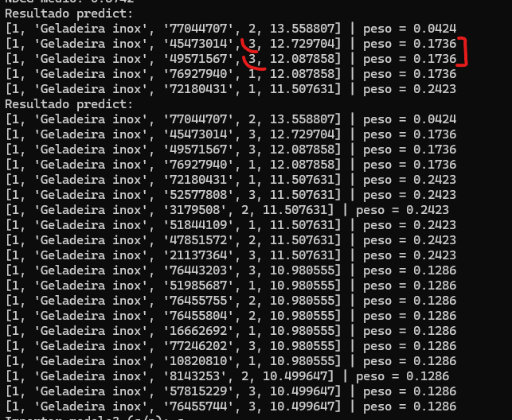

# Term Seed  

A set of initial terms used as the basis for generating the judgment list.  

**Example:** "Stainless steel refrigerator", "Smartphone 128GB", etc.  

## Step 1: Judgment List Creation (create_judgment_index)  

The `create_judgment_index` file generates a judgment list in our **HLG environment**.  

This list is stored in an index that allows for further analysis.  

## Step 2: Model Training and Configuration (create_and_configure_model)  

The `create_and_configure_model` file extracts features from the judgment list and trains the ranking model.  

With this process, the trained model can be deployed to **HLG Elasticsearch** for ranking optimization.  

## Ideal Context  

For **query_id = 1** with the term **"stainless steel refrigerator"**,  

the document with the highest weight should appear at the **top** of the search results page.  

## Storage and Analysis  

The data is pre-stored in the index to facilitate analysis and model refinement.  

## Model Training  

The stored data is extracted from the index and used to train a ranking model.  

The model learns to rank documents based on the collected properties.  

## Index Properties  

- **query_id** → Unique identifier for the query.  
- **query** → Text of the performed query.  
- **doc_id** → Identifier of the document returned in the search.  
- **grade** → Score assigned to the relevance of the document for the query.  
- **price** → Price of the returned product.  
- **popularity** → Popularity of the product (can be null if unavailable).  
- **category** → Product category.  
- **query_len** → Number of terms in the query.  
- **nome_score** → Score associated with the product name.  
